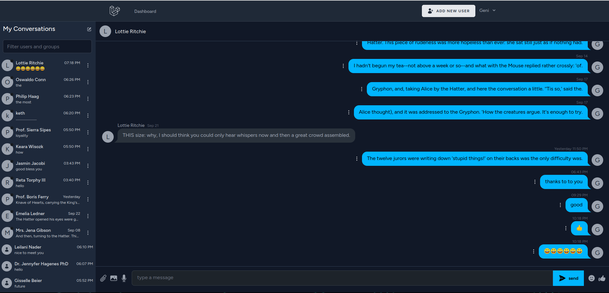

## Messenger App

Full Stack messenger application with react 18, typescript, tailwindcss, reverb ,inertia, Dokcer and Laravel 11

## Demo

comming soon...

## Installation with docker

1.Clone the project

    git@github.com:Moyhe/messenger-app.git

2.Run composer install && npm install then

Navigate into project folder using terminal and run

    docker run --rm \
    -u "$(id -u):$(id -g)" \
    -v "$(pwd):/var/www/html" \
    -w /var/www/html \
    laravelsail/php82-composer:latest \
    composer install --ignore-platform-reqs

3.Copy .env.example into .env

    cp .env.example .env

4.Start the project in detached mode

    ./vendor/bin/sail up -d

5.start vite serever

    npm run dev

From now on whenever you want to run artisan command you should do this from the container.
Access to the docker container

    ./vendor/bin/sail bash

6.Set encryption key

    php artisan key:generate --ansi

7.Run migrations

    php artisan migrate

8.to seed data

    php artisan migrate --seed

9.to start the reverb server run

    ./vendor/bin/sail artisan reverb:start --debug

10.to run the queue jobs run

./vendor/bin/sail artisan queue:listen

## Features

1. Registration & Login & profile
2. chat with users and groups
3. block and unblock users
4. perform CRUD operations for admins, groups and users
5. reverb for real time messaging
6. sendning emojis, attachments, voice message and images
7. searcing for users and groups
8. Load older messages with infinite scroll loading
9. Deleting your own sent messages
